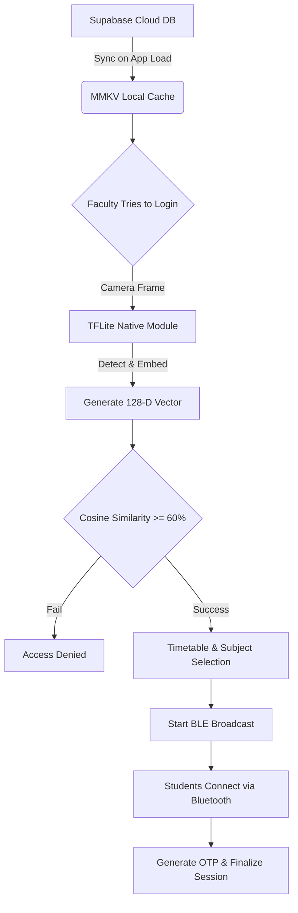

# 🎓 Academic Monitor: Faculty Authentication & BLE Session Manager


The **Academic Monitor (Faculty App)** is a robust, offline-first React Native mobile application engineered specifically to solve the pervasive issues of **proxy attendance** and **spotty internet connectivity** in academic institutions.

By combining edge-based Artificial Intelligence (TensorFlow Lite) for facial verification with localized peer-to-peer Bluetooth Low Energy (BLE) networks for student management, this app allows a professor to securely log in, verify their identity, and host an attendance session without requiring *any* active internet connection during class time.

---

## ✨ Comprehensive Feature Set

### 1. 🛡️ Offline-First Facial Recognition (Edge AI)
* **On-Device Processing:** Live camera feeds are processed entirely on the user's device via a custom Kotlin Native Module.
* **TFLite Integration:** Utilizes a lightweight MobileFaceNet model to detect faces, crop, align, and generate 128-D embedding vectors in real-time.
* **Cosine Similarity Matching:** The live embedding is compared against the database embeddings using an optimized Cosine Similarity algorithm (verification threshold ≥ 60%).
* **Anti-Spoofing:** Built-in liveness checks ensure that a physical photograph or a screen cannot be used to bypass authentication.

### 2. 📡 Peer-to-Peer BLE Session Broadcasting
* **Local Networking:** Once authenticated, the faculty's device acts as a BLE peripheral, advertising a secure session payload (Subject, Branch, Semester, Section).
* **Zero Internet Required:** Student devices (running the Student counterpart app) detect this BLE broadcast and initiate a handshake entirely offline over Bluetooth.
* **Real-time Tracking:** The Faculty app displays a live, pulsing radar UI updating dynamically as students physically join the local network.

### 3. 🔐 Secure OTP Confirmation Protocol
* **Dynamic Generation:** After the BLE session gathers students, the faculty generates a session-specific 6-digit One-Time Password (OTP).
* **Physical Presence Verification:** Only students physically present to see/hear the OTP can enter it into their devices to confirm their attendance.

### 4. ⚡ Blazing Fast Local Storage (MMKV)
* The application employs `react-native-mmkv` to cache Supabase database embeddings and faculty timetables. This provides synchronous, high-speed read operations which are crucial for rendering UI states instantly and performing the vector matching offline.

---

## 🏗️ Architecture & Data Flow



---

## 📂 Project Structure

```text
e:\Faculty\
├── android/                  # Native Android configuration, Kotlin BLE/TFLite Modules
├── ios/                      # Native iOS configuration
├── src/
│   ├── ble/                  # Custom FacultyBLEModule definitions & constants
│   ├── constants/            # Theming, UI colors, typography
│   ├── hooks/                # Custom React hooks (e.g., useFaceRecognition)
│   ├── navigation/           # React Navigation stack configuration
│   ├── screens/              # Core UI Screens
│   │   ├── FaceScanScreen    # The facial auth & scanning interface
│   │   ├── BLESessionScreen  # The live radar & student connection manager
│   │   ├── OTPScreen         # OTP Generation and display
│   │   ├── ResultScreen      # Final attendance review and submission
│   │   └── TimetableScreen   # Faculty schedule and class selection
│   └── services/             # Core business logic
│       ├── faceService.ts    # Model initialization and Cosine Similarity logic
│       ├── supabaseClient.ts # Cloud database connection
│       └── timetableService.ts# Schedule parsing logic
```

---

## 🚀 Getting Started

### Prerequisites
* **Node.js:** v18.x or newer
* **React Native CLI:** Environment set up for Android and iOS development
* **Java:** JDK 17 (Required for Android build)
* **Supabase:** A configured Supabase project with a `faculties` table (requires `face_embedding` vector columns).

### Installation & Execution

1. **Clone the Repository**
   ```bash
   git clone https://github.com/nitishvofficial/Faculty.git
   cd Faculty
   ```

2. **Install JavaScript Dependencies**
   ```bash
   npm install
   ```

3. **Configure Environment Variables**
   Ensure that the Supabase keys inside `src/services/supabaseClient.ts` are correctly pointing to your cloud instance.

4. **Start the Metro Bundler**
   ```bash
   npm start
   ```

5. **Run the Application**
   ```bash
   # In a new terminal window
   npm run android
   ```
   > *Note: For Face Recognition and BLE to work correctly, testing must be done on a physical Android device, not an emulator, as emulators lack reliable Bluetooth and camera hardware abstraction.*

---

## 🔒 Security & Privacy Notice
All biometric data processed by the Academic Monitor application remains on the physical device. During the facial recognition phase, the native pipeline processes the camera feed in RAM, generates a mathematical embedding, compares it, and then flushes the image. **No raw photos, video feeds, or personal biometrics are uploaded or transmitted to the cloud.**

---

## 🤝 Contributing
Since this application interacts heavily with custom Native Modules for TFLite and BLE, contributors should be comfortable working with Kotlin (`android/app/src/main/java/...`) alongside React Native (`src/`).

1. Fork the repository
2. Create your feature branch (`git checkout -b feature/AmazingFeature`)
3. Commit your changes (`git commit -m 'Add some AmazingFeature'`)
4. Push to the branch (`git push origin feature/AmazingFeature`)
5. Open a Pull Request

---

*Engineered for secure, offline, and reliable classroom management.*