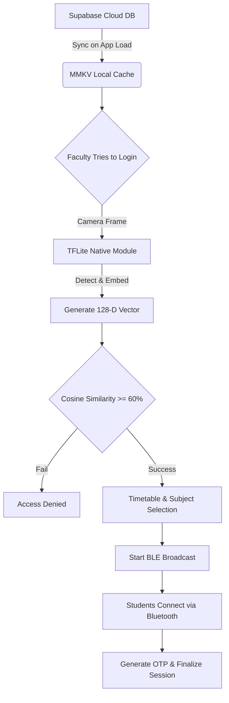
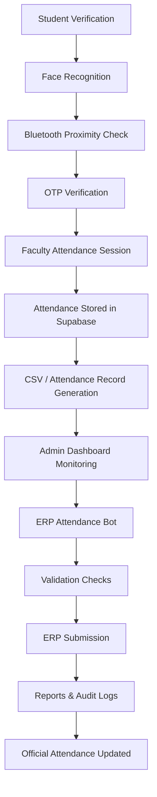

# 🎓 Academic Monitor: Faculty Authentication & BLE Session Manager


The **Academic Monitor (Faculty App)** is a robust, offline-first React Native mobile application engineered specifically to solve the pervasive issues of **proxy attendance** and **spotty internet connectivity** in academic institutions.

By combining edge-based Artificial Intelligence (TensorFlow Lite) for facial verification with localized peer-to-peer Bluetooth Low Energy (BLE) networks for student management, this app allows a professor to securely log in, verify their identity, and host an attendance session without requiring *any* active internet connection during class time.

---

## ✨ Comprehensive Feature Set

### 1. 🛡️ Offline-First Facial Recognition (Edge AI)
* **On-Device Processing:** Live camera feeds are processed entirely on the user's device via a custom Kotlin Native Module.
* **TFLite Integration:** Utilizes a lightweight MobileFaceNet model to detect faces, crop, align, and generate 128-D embedding vectors in real-time.
* **Cosine Similarity Matching:** The live embedding is compared against the database embeddings using an optimized Cosine Similarity algorithm (verification threshold ≥ 60%).
* **Anti-Spoofing:** Built-in liveness checks ensure that a physical photograph or a screen cannot be used to bypass authentication.

### 2. 📡 Peer-to-Peer BLE Session Broadcasting
* **Local Networking:** Once authenticated, the faculty's device acts as a BLE peripheral, advertising a secure session payload (Subject, Branch, Semester, Section).
* **Zero Internet Required:** Student devices (running the Student counterpart app) detect this BLE broadcast and initiate a handshake entirely offline over Bluetooth.
* **Real-time Tracking:** The Faculty app displays a live, pulsing radar UI updating dynamically as students physically join the local network.

### 3. 🔐 Secure OTP Confirmation Protocol
* **Dynamic Generation:** After the BLE session gathers students, the faculty generates a session-specific 6-digit One-Time Password (OTP).
* **Physical Presence Verification:** Only students physically present to see/hear the OTP can enter it into their devices to confirm their attendance.

### 4. ⚡ Blazing Fast Local Storage (MMKV)
* The application employs `react-native-mmkv` to cache Supabase database embeddings and faculty timetables. This provides synchronous, high-speed read operations which are crucial for rendering UI states instantly and performing the vector matching offline.

---

## 🏗️ Architecture & Data Flow


```mermaid
graph TD
    A[Supabase Cloud DB] -->|"Sync on App Load"| B(MMKV Local Cache)
    B --> C{"Faculty Tries to Login"}
    C -->|"Camera Frame"| D[TFLite Native Module]
    D -->|"Detect & Embed"| E[Generate 128-D Vector]
    E --> F{"Cosine Similarity >= 60%"}
    F -->|"Fail"| G[Access Denied]
    F -->|"Success"| H[Timetable & Subject Selection]
    H --> I[Start BLE Broadcast]
    I --> J[Students Connect via Bluetooth]
    J --> K[Generate OTP & Finalize Session]
```

---

## 📂 Project Structure

```text
e:\Faculty\
├── android/                  # Native Android configuration, Kotlin BLE/TFLite Modules
├── ios/                      # Native iOS configuration
├── src/
│   ├── ble/                  # Custom FacultyBLEModule definitions & constants
│   ├── constants/            # Theming, UI colors, typography
│   ├── hooks/                # Custom React hooks (e.g., useFaceRecognition)
│   ├── navigation/           # React Navigation stack configuration
│   ├── screens/              # Core UI Screens
│   │   ├── FaceScanScreen    # The facial auth & scanning interface
│   │   ├── BLESessionScreen  # The live radar & student connection manager
│   │   ├── OTPScreen         # OTP Generation and display
│   │   ├── ResultScreen      # Final attendance review and submission
│   │   └── TimetableScreen   # Faculty schedule and class selection
│   └── services/             # Core business logic
│       ├── faceService.ts    # Model initialization and Cosine Similarity logic
│       ├── supabaseClient.ts # Cloud database connection
│       └── timetableService.ts# Schedule parsing logic
```

---

## 🚀 Getting Started

### Prerequisites
* **Node.js:** v18.x or newer
* **React Native CLI:** Environment set up for Android and iOS development
* **Java:** JDK 17 (Required for Android build)
* **Supabase:** A configured Supabase project with a `faculties` table (requires `face_embedding` vector columns).

### Installation & Execution

1. **Clone the Repository**
   ```bash
   git clone https://github.com/nitishvofficial/Faculty.git
   cd Faculty
   ```

2. **Install JavaScript Dependencies**
   ```bash
   npm install
   ```

3. **Configure Environment Variables**
   Ensure that the Supabase keys inside `src/services/supabaseClient.ts` are correctly pointing to your cloud instance.

4. **Start the Metro Bundler**
   ```bash
   npm start
   ```

5. **Run the Application**
   ```bash
   # In a new terminal window
   npm run android
   ```
   > *Note: For Face Recognition and BLE to work correctly, testing must be done on a physical Android device, not an emulator, as emulators lack reliable Bluetooth and camera hardware abstraction.*

---

## 🔒 Security & Privacy Notice
All biometric data processed by the Academic Monitor application remains on the physical device. During the facial recognition phase, the native pipeline processes the camera feed in RAM, generates a mathematical embedding, compares it, and then flushes the image. **No raw photos, video feeds, or personal biometrics are uploaded or transmitted to the cloud.**

---

## 🤖 ERP Attendance Bot

### Purpose

The ERP Attendance Bot is the final automation layer of the Academic Monitor ecosystem.

Its responsibility is **not to verify attendance**. Attendance verification has already been completed through multiple security layers within the Student and Faculty applications:

* Face Recognition Authentication
* Bluetooth Proximity Verification
* OTP Validation
* Faculty-Controlled Attendance Session

The bot's sole responsibility is to transfer verified attendance records into the institution's official ERP system automatically.

---

### Workflow After Faculty Session Ends

#### Step 1 — Session Completion

Once the faculty member ends an attendance session:

* All verified attendance records are finalized.
* Attendance data is stored securely in Supabase.
* A session summary is generated containing:

  * Faculty information
  * Subject details
  * Branch and section
  * Attendance timestamps
  * Present student list

---

#### Step 2 — Attendance Export

The Faculty Application automatically generates structured attendance data.

Example:

| Roll Number | Student Name | Status  | Time     |
| ----------- | ------------ | ------- | -------- |
| 221FA001    | Student A    | Present | 10:08 AM |
| 221FA002    | Student B    | Present | 10:11 AM |

The records are then uploaded to the central database and made available to the Admin Dashboard and ERP Bot.

---

#### Step 3 — Admin Monitoring

Administrators can monitor:

* Attendance sessions
* Exported records
* Upload history
* Synchronization status
* Processing logs

This provides complete traceability before ERP submission.

---

#### Step 4 — Scheduled ERP Processing

At the configured processing window (for example, 6 PM – 7 PM daily), the ERP Bot starts automatically.

The bot:

1. Retrieves pending attendance records.
2. Validates attendance counts.
3. Checks holiday schedules.
4. Verifies session integrity.
5. Identifies records that have not yet been uploaded to ERP.

Only verified attendance records are processed.

---

#### Step 5 — ERP Login

Using secure credentials stored in the system, the bot:

* Opens the institution ERP portal.
* Authenticates successfully.
* Navigates to the faculty attendance module.

---

#### Step 6 — Attendance Mapping

The bot loads:

* Faculty information
* Subject details
* Class roster
* Student roll numbers

It then matches verified attendance records with the ERP class roster.

Example:

Verified Attendance:

* 221FA001
* 221FA002
* 221FA005

ERP Roster:

* 221FA001
* 221FA002
* 221FA003
* 221FA004
* 221FA005

Matched students are marked present.

---

#### Step 7 — Validation Layer

Before submission, the system performs validation checks:

* Duplicate detection
* Missing records verification
* Session consistency checks
* Faculty and subject matching
* Attendance count verification

If any inconsistency is detected:

* ERP submission is halted.
* Error logs are generated.
* Manual review is required.

---

#### Step 8 — ERP Submission

After successful validation:

* Attendance is entered into the ERP system.
* Records are submitted automatically.
* Submission confirmation is captured.

---

#### Step 9 — Audit Logging

Every ERP operation is logged, including:

* Login status
* Submission status
* Processing duration
* Attendance counts
* Success or failure reports

These logs are visible through the Admin Dashboard.

---

#### Step 10 — Report Generation

After processing completes, the bot generates:

* Daily attendance reports
* ERP synchronization reports
* Failed submission reports
* Audit logs

Reports are stored for future reference and compliance.

---

### Safety-First Design

The ERP Bot follows a strict principle:

> Wrong attendance is worse than missing attendance.

Whenever uncertainty exists, the system:

* Stops automatic submission
* Generates detailed logs
* Requests administrator review

This prevents incorrect attendance from being uploaded to the official ERP system.

---

### Technology Stack

**ERP Bot**

* TypeScript
* Playwright
* Supabase
* Scheduled Tasks
* Logging System
* Automated Report Generation

---

### End-to-End Flow


```mermaid
graph TD
    A[Student Verification] --> B[Face Recognition]
    B --> C[Bluetooth Proximity Check]
    C --> D[OTP Verification]
    D --> E[Faculty Attendance Session]
    E --> F[Attendance Stored in Supabase]
    F --> G[CSV / Attendance Record Generation]
    G --> H[Admin Dashboard Monitoring]
    H --> I[ERP Attendance Bot]
    I --> J[Validation Checks]
    J --> K[ERP Submission]
    K --> L[Reports & Audit Logs]
    L --> M[Official Attendance Updated]
```

---

## 🤝 Contributing
Since this application interacts heavily with custom Native Modules for TFLite and BLE, contributors should be comfortable working with Kotlin (`android/app/src/main/java/...`) alongside React Native (`src/`).

1. Fork the repository
2. Create your feature branch (`git checkout -b feature/AmazingFeature`)
3. Commit your changes (`git commit -m 'Add some AmazingFeature'`)
4. Push to the branch (`git push origin feature/AmazingFeature`)
5. Open a Pull Request

---

*Engineered for secure, offline, and reliable classroom management.*
